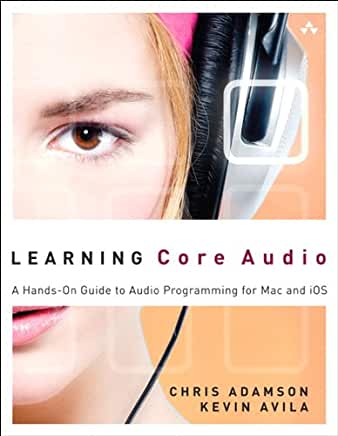

# Learning Core Audio

[Publisher's Site](https://www.informit.com/store/learning-core-audio-a-hands-on-guide-to-audio-programming-9780321636843)

This is the only relatively thorough reference I could find on using CoreAudio and related frameworks. It wast published in 2012. The last updates to the publisher's website are from 2014. The source code in the book is in Objective-C.

As part of my effort to learn Core Audio, I decided to get the source code examples running in Swift 5.

## Alternate Project
Derekli66 [github](https://github.com/derekli66/Learning-Core-Audio-Swift-SampleCode)
already published a project doing much the same thing. As I was doing this as a learning exercised, I tried to write all my code on my own (although I did a lot of web searching), but there were a couple of times when I got stuck and looked at this code. Most notably, I used the code for the wrapper for CARingBuffer.

## Project Details
Instead of separate projects, I put all the examples in one project. I created separate targets for each separate project.

All of the code runs on a M1 Mac Mini running OSX Monterey 12.3.1. Xcode is version 13.3.

The only warnings are deprecation warnings in the projects using OpenAL (CAStreamOpenAL & CAPositionalAudio) which has been deprecated in favoer of AudioEngine.

## CAAudioGraphPlayThrough
The file CAAudioGraphPlayThrough is the first attempt at converting the code Play Through example from Chapter 8. CAAudioGraphPlayThroughMEE rewrites the code using some extensions (see Utility/CAExtensions) to simplify the API calls. CAAudioEnginePlayThroughMEE rewrites the code using AVAudioEngine rather than AUGraph.

## PART_II
In the book, the AUSpeech and AUGraphPlayThrough examples were written in two parts. A #ifdef PART_II was used to compile the code two different ways. In the Swift version, #if PART_II was used and two build targets were created, one that defined PART_II and one that didn't.

## TouchDownUp
This code was found at [TouchDownUp](https://betterprogramming.pub/implement-touch-events-in-swiftui-b3a2b0700fd4) and is by Andrew Zheng.

## CARingBuffer
CARingBuffer is part of the [Core Audio Utility Classes](https://developer.apple.com/library/archive/samplecode/CoreAudioUtilityClasses/Introduction/Intro.html) from Apple (use the Download Sample Code button at the top of the screen).

There are some changes:
- The original CARingBuffer.cpp file had #include statements for CABitOperations.h, CAAutoDisposer.h and CAAtomic.h. The needed parts of these files were copied into CARingBufer.h
- The method CARingBuffer::SettimeBounds called CAAtomicCompareAndSwap32Barrier which called (in CAAtomic.h) OSAtomicCompareAndSwap32Barrier which is deprecated. The method is used to increment a pointer. It was replaced by making the pointer atomic and using the ++ operator.

To use CARingBuffer with Swift requires Objective-C files CARingBufferWrapper.h and CARingBufferWrapper.mm and a bridging header file CARRingBuffer-Bridging-Header.h

The CARingBufferWrapper files create the interface that Swift file can use to call the CARingBuffer routines.

CARingBuffer-Bridging-Header.h was auto-generated by Xcode.
CARingBufferWrapper.h and CARingBufferWrapper.mm were taken from [Learning-Core-Audio-Swift-SampleCode](https://github.com/derekli66/Learning-Core-Audio-Swift-SampleCode) on GitHub.

## Notes
This project helped me learn a lot about CoreAudio as well as the was Swith handles pointers. I also learned how to assemble larger projects within Xcode.

You are free to use the code in any way you need, but it is provided AS-IS. I provide no guarantees about it.

If you find an issue, please let me know. I'm still learning, and if I've done something wrong, I would like to know about it.
